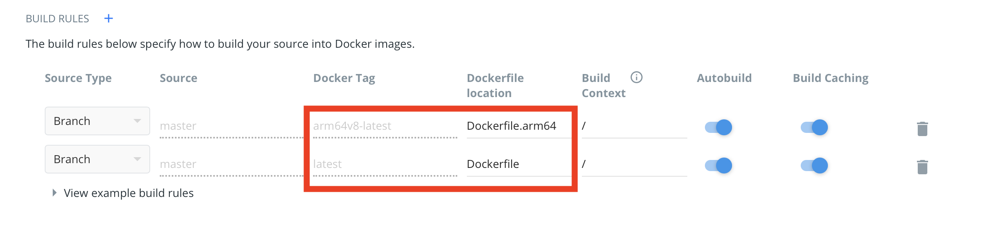

# Build Multi-Arch Docker Images Using Docker Hub's Automated Build
This repo demonstrates how to build docker images for `amd64` and `arm64v8` using:

1. [Docker Hub's automated build](https://docs.docker.com/docker-hub/builds/)
1. [`qemu-user-static`](https://github.com/multiarch/qemu-user-static)

Updates made to this [repo](https://github.com/raymondwcs/dockerimage.nodejs_arm64v8.git) triggers auto build of the following Docker images, which reside in this [Docker Hub repository](https://hub.docker.com/repository/docker/raymondwcs/node).

1. [`amd64`](Dockfile)
1. [`arm64v8`](Dockerfile.arm64)

## Docker Hub Automated Build Rules

## Docker Hub Automated Build Hooks
### `pre_build`
This [script](hooks/pre_build) prepares the environemnt for building `arm64` images 

### `post_push`
This [script](hooks/post_push) creates a multi-arch manifest

## Reference
- https://www.docker.com/blog/multi-arch-build-and-images-the-simple-way/
- https://github.com/cgiraldo/docker-hello-multiarch
